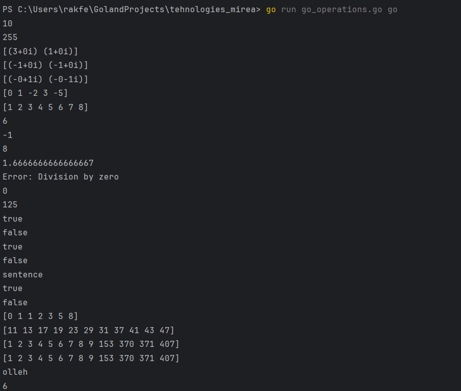

### В данной практике выполнялись простые(и не особо) функции на языке GO.
````
package main

import (
	"fmt"
	"math"
	"sort"
	"strconv"
	"strings"
	"unicode"
)

func convertBase(num string, fromBase, toBase int) string {
	i, err := strconv.ParseInt(num, fromBase, 64)
	if err != nil {
		return "Invalid input"
	}
	return strconv.FormatInt(i, toBase)
}

func solveQuadraticEquation(a, b, c float64) []complex128 {
	discriminant := b*b - 4*a*c
	if discriminant >= 0 {
		x1 := (-b + math.Sqrt(discriminant)) / (2 * a)
		x2 := (-b - math.Sqrt(discriminant)) / (2 * a)
		return []complex128{complex(x1, 0), complex(x2, 0)}
	} else {
		x1 := complex(-b/(2*a), math.Sqrt(-discriminant)/(2*a))
		x2 := complex(-b/(2*a), -math.Sqrt(-discriminant)/(2*a))
		return []complex128{x1, x2}
	}
}

func sortByAbs(nums []int) []int {
	sort.Slice(nums, func(i, j int) bool {
		return math.Abs(float64(nums[i])) < math.Abs(float64(nums[j]))
	})
	return nums
}

func mergeSortedArrays(arr1, arr2 []int) []int {
	merged := make([]int, len(arr1)+len(arr2))
	i, j, k := 0, 0, 0
	for i < len(arr1) && j < len(arr2) {
		if arr1[i] < arr2[j] {
			merged[k] = arr1[i]
			i++
		} else {
			merged[k] = arr2[j]
			j++
		}
		k++
	}
	for i < len(arr1) {
		merged[k] = arr1[i]
		i++
		k++
	}
	for j < len(arr2) {
		merged[k] = arr2[j]
		j++
		k++
	}
	return merged
}

func findSubstring(str, substr string) int {
	for i := 0; i <= len(str)-len(substr); i++ {
		if str[i:i+len(substr)] == substr {
			return i
		}
	}
	return -1
}

func calculator(num1, num2 float64, operator string) float64 {
	switch operator {
	case "+":
		return num1 + num2
	case "-":
		return num1 - num2
	case "*":
		return num1 * num2
	case "/":
		if num2 == 0 {
			fmt.Println("Error: Division by zero")
			return 0 // Или другое значение, указывающее на ошибку
		}
		return num1 / num2
	case "^":
		return math.Pow(num1, num2)
	case "%":
		return math.Mod(num1, num2)
	default:
		fmt.Println("Error: Invalid operator")
		return 0 // Или другое значение, указывающее на ошибку
	}
}

func isPalindrome(str string) bool {
	processedStr := strings.ToLower(strings.Map(func(r rune) rune {
		if unicode.IsLetter(r) || unicode.IsDigit(r) {
			return r
		}
		return -1
	}, str))
	for i, j := 0, len(processedStr)-1; i < j; i, j = i+1, j-1 {
		if processedStr[i] != processedStr[j] {
			return false
		}
	}
	return true
}

func intersectionOfThreeSegments(a1, a2, b1, b2, c1, c2 int) bool {
	start := math.Max(math.Max(float64(a1), float64(b1)), float64(c1))
	end := math.Min(math.Min(float64(a2), float64(b2)), float64(c2))
	return start <= end
}

func longestWord(sentence string) string {
	words := strings.FieldsFunc(sentence, func(r rune) bool {
		return !unicode.IsLetter(r) && !unicode.IsDigit(r)
	})
	longest := ""
	for _, word := range words {
		if len(word) > len(longest) {
			longest = word
		}
	}
	return longest
}

func isLeapYear(year int) bool {
	return (year%4 == 0 && year%100 != 0) || year%400 == 0
}

func fibonacci(n int) []int {
	fib := []int{}
	a, b := 0, 1
	for a <= n {
		fib = append(fib, a)
		a, b = b, a+b
	}
	return fib
}

func primeNumbersInRange(start, end int) []int {
	primes := []int{}
	for num := start; num <= end; num++ {
		isPrime := true
		if num <= 1 {
			isPrime = false
		} else {
			for i := 2; i*i <= num; i++ {
				if num%i == 0 {
					isPrime = false
					break
				}
			}
		}
		if isPrime {
			primes = append(primes, num)
		}
	}
	return primes
}

func armstrongNumbersInRange(start, end int) []int {
	armstrongNums := []int{}

	for num := start; num <= end; num++ {
		sum := 0
		temp := num
		numDigits := len(strconv.Itoa(num))

		for temp > 0 {
			digit := temp % 10
			sum += int(math.Pow(float64(digit), float64(numDigits)))
			temp /= 10
		}

		if sum == num {
			armstrongNums = append(armstrongNums, num)
		}
	}

	return armstrongNums
}

func reverseString(str string) string {
	runes := []rune(str)
	for i, j := 0, len(runes)-1; i < j; i, j = i+1, j-1 {
		runes[i], runes[j] = runes[j], runes[i]
	}
	return string(runes)
}

func gcd(a, b int) int {
	for b != 0 {
		a, b = b, a%b
	}
	return a
}

func main() {
	//1
	fmt.Println(convertBase("1010", 2, 10))
	fmt.Println(convertBase("FF", 16, 10))

	//2
	fmt.Println(solveQuadraticEquation(1, -4, 3))
	fmt.Println(solveQuadraticEquation(1, 2, 1))
	fmt.Println(solveQuadraticEquation(1, 0, 1))

	//3
	nums := []int{-2, 1, -5, 3, 0}
	sortedNums := sortByAbs(nums)
	fmt.Println(sortedNums)

	//4
	arr1 := []int{1, 3, 5, 7}
	arr2 := []int{2, 4, 6, 8}
	mergedArray := mergeSortedArrays(arr1, arr2)
	fmt.Println(mergedArray)

	//5
	fmt.Println(findSubstring("hello world", "world"))
	fmt.Println(findSubstring("hello world", "golang"))

	// Условия
	fmt.Println(calculator(5, 3, "+"))
	fmt.Println(calculator(5, 3, "/"))
	fmt.Println(calculator(5, 0, "/"))
	fmt.Println(calculator(5, 3, "^"))
	fmt.Println(isPalindrome("A man, a plan, a canal: Panama"))
	fmt.Println(isPalindrome("hello"))
	fmt.Println(intersectionOfThreeSegments(1, 5, 2, 6, 3, 4))
	fmt.Println(intersectionOfThreeSegments(1, 3, 4, 6, 5, 7))
	fmt.Println(longestWord("This is a test sentence!"))
	fmt.Println(isLeapYear(2000))
	fmt.Println(isLeapYear(2001))

	// Циклы
	fmt.Println(fibonacci(10))
	fmt.Println(primeNumbersInRange(10, 50))
	fmt.Println(armstrongNumbersInRange(1, 1000))
	fmt.Println(reverseString("hello"))
	fmt.Println(gcd(48, 18))

}
````
На скриншоте представлен вывод операций
